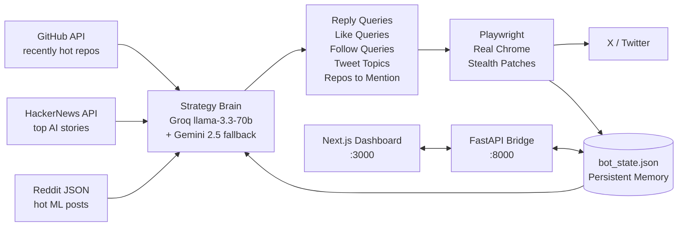

<div align="center">

<br />

# Twitter Growth System

<sub>**[ autonomous · trend-aware · self-pacing ]**</sub>

<br />

#### A complete X / Twitter growth system that researches what's actually trending before it speaks.

<sub>Built for builders who'd rather ship code than schedule tweets.</sub>

<br />


<br />


<br />

`╌────────────────────────────────────────────────────────╌`

</div>

<br />

<br />

## One-prompt setup

<sub>Have an AI coding agent (Claude Code, Cursor, Windsurf, Aider, etc.) set this whole thing up for you. Copy the block below into your agent's prompt, hit enter, answer the questions when it asks.</sub>

<br />

```
You are setting up the Twitter Growth System on my Windows machine.
Repo: https://github.com/yuno7777/twitter-automation

Follow these steps in order. Stop and ASK me when you need input.

STEP 1 — Clone
- Clone the repo to C:\Users\<me>\Desktop\projects\twitter-growth-system
  (substitute my actual Windows username for <me> — ask me if unsure)

STEP 2 — Verify prerequisites
- Confirm Python 3.11+, Node.js 18+, and Google Chrome are installed.
  If any are missing, STOP and tell me what to install.

STEP 3 — Install bot dependencies
- cd bot
- pip install -r requirements.txt
- python -m playwright install chromium

STEP 4 — Configure .env
- ASK ME for these values, one by one:
  1. GROQ_API_KEY  (free at console.groq.com)
  2. GEMINI_API_KEY  (free at aistudio.google.com)
  3. X_HANDLE  (my Twitter/X username without the @)
  4. NICHE  (1-2 sentences — what my account is about)
- Copy .env.example to .env at the project root
- Fill in the values I gave you. Leave PROXY_URL empty.
- Keep HEADLESS=true and DRY_RUN=false.

STEP 5 — Customize voice
- Open bot/prompts/style_notes.txt
- ASK ME 3 questions:
  a) Who am I writing as (builder, founder, researcher, etc.)?
  b) Name 2-3 opinions I actually hold about AI/tech.
  c) Name 2-3 tools I actually use day-to-day (Claude, Cursor, n8n, etc.).
- Rewrite the style_notes.txt file using my answers. Keep the existing
  structure (WHO I AM / HOW I WRITE / OPINIONS I HOLD / THINGS I NEVER SAY)
  but make every line authentic to me.

STEP 6 — First-time X login (this requires me)
- Run: cd bot ; $env:HEADLESS="false" ; python x_automation_bot.py login
- A real Chrome window will open. STOP and tell me to log in manually.
- Wait for me to confirm I've reached the home feed before continuing.
- The bot will auto-save cookies to bot/cookies.json.

STEP 7 — Install dashboard
- cd ../dashboard
- npm install
- Copy .env.local.example to .env.local

STEP 8 — Wire up the launcher paths
- Open launcher.ps1 and stopper.ps1 at the project root.
- Update the $root variable at the top of each to match the actual project path
  on my machine (use the path from Step 1).

STEP 9 — Create desktop shortcuts
- Create C:\Users\<me>\Desktop\Start Twitter Growth.vbs containing:
    Set sh = CreateObject("WScript.Shell")
    sh.Run "powershell.exe -NoProfile -ExecutionPolicy Bypass -WindowStyle Hidden -File ""<full path to launcher.ps1>""", 0, False
- Create C:\Users\<me>\Desktop\Stop Twitter Growth.vbs the same way,
  pointing at stopper.ps1.
- Substitute the real absolute paths — no <placeholders>.

STEP 10 — First launch
- Double-click Start Twitter Growth.vbs (or run the VBS via wscript)
- Tell me to wait 15-30 seconds for Chrome to open the dashboard at
  http://localhost:3000

STEP 11 — Verify
- Confirm the dashboard loads, the status pill shows RUNNING, and the
  Memory page populates within a few minutes.

If any step fails, show me the exact error from logs/bot.log, logs/api.log,
or logs/dashboard.log and propose a fix before continuing.
```

<br />

<sub>Once it's running, the rest of the README is reference — skip to **Dashboard** below to see what each page does.</sub>

<br />

---

<br />

```
   Every 2 hours, autonomously:

   ▸  researches    →   GitHub trending · HackerNews · Reddit r/LocalLLaMA
   ▸  writes        →   1–3 tweet thread in your voice, on actually-trending topics
   ▸  critiques     →   every draft scored 1–10 before posting, regenerates if weak
   ▸  engages       →   5 thoughtful replies, intelligently filtered (no spam/ragebait)
   ▸  quotes        →   1 viral post per cycle with a sharper take
   ▸  follows up    →   continues conversations on your own tweets
   ▸  likes         →   10 niche tweets to warm the algo signal
   ▸  follows       →   1–2 high-quality accounts (conservatively)
   ▸  drafts        →   off-peak hours generate tweets to your approval queue
   ▸  learns        →   tracks own top + bottom performers, biases toward what works
   ▸  studies       →   scrapes tracked creators in your niche for live style reference
   ▸  varies        →   rotates 6 content modes (hook · story · contrarian · listicle · question · comparison)
```

<br />

> No paid X API. No paid LLM. No proxy required.
> Just a real Chrome browser, a free Groq + Gemini key, and ~110 minutes of
> spread-out activity per cycle.

<br />

---

<br />

## What makes it different

<table>
<tr>
<td width="33%" valign="top">

#### ◆ real trend discovery

Scrapes **GitHub recent-hot repos**, **HackerNews AI stories**, and **Reddit r/LocalLLaMA + r/singularity** every cycle. An LLM strategy brain decides what to search on X based on what's trending *right now* — not a hardcoded list.

</td>
<td width="33%" valign="top">

#### ◆ pre-flight tweet critic

Every draft (tweet, reply, quote, follow-up) is scored 1–10 on hook strength, voice match, and value by a second LLM call. Score below 7? Auto-regenerated up to 3 times.

</td>
<td width="33%" valign="top">

#### ◆ smart reply candidate analyzer

Doesn't just pick the most-liked tweet. LLM classifies each candidate (`spam · giveaway · ragebait · genuine`), reads sentiment, and picks the one worth replying to with the right reply style.

</td>
</tr>
<tr>
<td valign="top">

#### ◆ engagement learning loop

Scrapes your own top **and** bottom-performing tweets each cycle. Both get fed into the next prompt — *"write more like these, avoid those."* The bot compounds toward what works for *your* audience.

</td>
<td valign="top">

#### ◆ quote-tweet capability

Finds viral fresh tweets in your niche, generates a sharper take, posts as a quote-tweet. Quote-tweets get 2–3× the reach of plain replies on X.

</td>
<td valign="top">

#### ◆ conversation continuation

When someone replies to your tweet, the bot drafts a thoughtful follow-up. Sentiment-filtered: skips anything hostile or sarcastic. Max one follow-up per thread.

</td>
</tr>
<tr>
<td valign="top">

#### ◆ off-hours draft queue

During off-peak hours, the bot drafts tweets to a queue instead of posting blindly. Wake up, review them on `/queue`, approve / edit / reject. Approved drafts post automatically next peak hour.

</td>
<td valign="top">

#### ◆ real chrome, not headless

X aggressively blocks Playwright's bundled Chromium. Uses your installed Chrome with a persistent user-data-dir. **Cookie-based login, no password ever stored.**

</td>
<td valign="top">

#### ◆ one-click launcher

Double-click a `.vbs` on your Desktop → 3 hidden background processes start → Chrome auto-opens to the dashboard. Zero terminal flash, zero taskbar clutter.

</td>
</tr>
</table>

<br />

---

<br />

## Architecture



<br />

---

<br />

## Quick start

<sub>Already set up? Double-click **`Start Twit-Auto.vbs`** on your desktop. Done.</sub>

<details>
<summary><b>First-time setup — click to expand</b></summary>

<br />

### Prerequisites

| requirement | why |
|---|---|
| Windows 10/11 | launcher VBS is Windows-specific (the code itself is cross-platform) |
| Python 3.11+ | bot runtime |
| Node.js 18+ | dashboard |
| Google Chrome | real browser channel (bundled Chromium gets blocked by X) |
| an X account | yours to control |
| Groq API key *(free)* | primary LLM — [console.groq.com](https://console.groq.com) |
| Gemini API key *(free)* | rate-limit fallback — [aistudio.google.com](https://aistudio.google.com) |

### 1. Clone

```bash
git clone https://github.com/yuno7777/twitter-automation.git twit-auto
cd twit-auto
```

### 2. Bot deps

```powershell
cd bot
pip install -r requirements.txt
python -m playwright install chromium
```

### 3. Configure `.env` *(project root)*

```env
GROQ_API_KEY=your_groq_key
GEMINI_API_KEY=your_gemini_key
LLM_PROVIDER=groq
HEADLESS=true

# Be specific — this drives every tweet
NICHE=AI agents, LLM workflows, and the gap between AI demos and what actually ships to production.

X_HANDLE=your_handle_no_at
PEAK_HOURS=9,10,13,14,19,20,21
DRY_RUN=false
```

### 4. First login *(saves cookies)*

```powershell
cd bot
$env:HEADLESS="false"
python x_automation_bot.py login
```

A real Chrome window opens. Log in manually. The bot auto-saves cookies once you reach the home feed.

### 5. Customize your voice

Open `bot/prompts/style_notes.txt` and **rewrite it in your own voice**. Single biggest lever for tweet quality.

### 6. Dashboard deps

```powershell
cd ../dashboard
npm install
copy .env.local.example .env.local
```

### 7. Desktop launchers

Place these two files on your Desktop:

**`Start Twit-Auto.vbs`**
```vbs
Set sh = CreateObject("WScript.Shell")
sh.Run "powershell.exe -NoProfile -ExecutionPolicy Bypass -WindowStyle Hidden -File ""C:\path\to\twit-auto\launcher.ps1""", 0, False
```

**`Stop Twit-Auto.vbs`**
```vbs
Set sh = CreateObject("WScript.Shell")
sh.Run "powershell.exe -NoProfile -ExecutionPolicy Bypass -WindowStyle Hidden -File ""C:\path\to\twit-auto\stopper.ps1""", 0, False
```

Update the paths. Also update `$root` at the top of `launcher.ps1` and `stopper.ps1`.

### 8. Launch

Double-click **`Start Twit-Auto.vbs`**. In 5–30 seconds, Chrome opens to `http://localhost:3000`.

</details>

<br />

---

<br />

## The dashboard

<div align="center">

<sub>Five pages. Dark theme. Lavender accents. Glassmorphism.</sub>

</div>

<br />

| page  | what it shows |
|:------|:---|
| `/`              | status, control buttons (start / pause / stop / **reset cycle**), countdown, stat row, recent activity |
| `/memory`        | live trending terms, current strategy, queued tweet angles, GitHub repos on radar, **pre-flight critic log** |
| `/queue`         | **off-hours drafts pending your approval** — approve / edit / reject before they post |
| `/analytics`     | daily activity stacked bars, hourly heatmap, your top-performing tweets |
| `/logs`          | Server-Sent Events stream of `x_bot.log` with colored levels |
| `/history`       | tweets · replies · **quotes** · **follow-ups** · follows tabs |
| `/settings`      | editable cycle limits, LLM provider, full prompt templates |

<br />

---

<br />

## One cycle, end to end

```
   T+0     initial wake-up delay (1 min)
   T+1     self-engagement scrape   (read own top + bottom tweets — what works, what doesn't)
   T+1     strategy synthesis       (fetch signals → LLM → fresh queries + trending terms)
   T+2     like 10 niche tweets     (trend-driven queries)
   T+14    PEAK: critic-gated post  (1 draft + auto-regen if score < 7)
           OFF: draft 3 → queue     (your approval needed on /queue)
   T+16    reply  1                 (analyzer picks best of 5 candidates, classifies + styles)
   T+27    reply  2
   T+39    reply  3
   T+51    reply  4
   T+63    reply  5
   T+75    quote-tweet              (viral post, 100–10k likes, under 4h old)
   T+87    conversation follow-ups  (up to 2 — only on non-hostile replies)
   T+110   follow 1                 (high-quality account)
   T+122   follow 2
   T+134   cycle complete           (sleep ~50 min before next cycle — 2h interval)
```

<sub>All cooldowns are `random.uniform(10, 12)` minutes — no fixed pattern X can fingerprint.</sub>

<br />

---

<br />

## The intelligence layer

```
   ┌── GitHub ──────────────────────────────────────────────┐
   │   search recently-created repos across 13 AI topics    │
   │   (ai-agents · agentic · llm · rag · mcp · autonomous) │
   │   sort by stars · return top 20                        │
   └────────────────────────────────────────────────────────┘
   ┌── HackerNews ──────────────────────────────────────────┐
   │   top 60 stories → filter for AI keyword regex →       │
   │   return matches with score + comment count            │
   └────────────────────────────────────────────────────────┘
   ┌── Reddit ──────────────────────────────────────────────┐
   │   r/LocalLLaMA hot + r/singularity hot                 │
   │   public JSON · no auth                                │
   └────────────────────────────────────────────────────────┘
                              │
                              ▼
   ┌── trending-term extraction ────────────────────────────┐
   │   regex pulls repo names + capitalised phrases from    │
   │   titles → ['Hermes 3', 'claude-code', 'MCP', 'GPT-OSS']│
   └────────────────────────────────────────────────────────┘
                              │
                              ▼
   ┌── LLM strategy brain ──────────────────────────────────┐
   │   sees:  all signals + memory + trending terms +       │
   │          recent queries the bot ran +                  │
   │          topics already covered + repos already used   │
   │                                                        │
   │   returns: { reply_queries, like_queries,              │
   │              follow_queries, tweet_topics[],           │
   │              github_repos_to_mention[] }               │
   └────────────────────────────────────────────────────────┘
                              │
                              ▼
   ┌── force-inject trending terms ─────────────────────────┐
   │   top 4 extracted terms PREPENDED to reply_queries     │
   │   top 3 PREPENDED to like_queries (deduped)            │
   │   belt-and-suspenders: even if LLM picks generics,     │
   │   the bot still searches actual trending names         │
   └────────────────────────────────────────────────────────┘
```

<br />

---

<br />

## Stealth & safety

| layer | what it does |
|:------|:---|
| real Chrome | `channel="chrome"` with persistent user-data-dir — X trusts it |
| stealth patches | manual `add_init_script` for `navigator.webdriver`, plugins, WebGL, permissions |
| no `playwright-stealth` | that PyPI package is unmaintained and detected |
| cookie-based login | password never touches disk |
| big random cooldowns | 10–12 min between every major action |
| selector resilience | every action wrapped in try/except + auto-screenshots on failure |
| state persistence | never reposts, never re-replies, never re-follows the same target |
| peak-hour gating | posts only during configurable peak hours; engagement continues off-peak |
| `DRY_RUN` mode | test the full cycle without actually posting |

<br />

---

<br />

## File structure

```
twit-auto/
├── bot/
│   ├── x_automation_bot.py     ◀ main bot
│   ├── intelligence.py         ◀ trend discovery + LLM strategy brain
│   ├── api_server.py           ◀ FastAPI bridge
│   ├── prompts/
│   │   ├── tweet_prompt.txt
│   │   ├── trend_tweet_prompt.txt
│   │   ├── reply_prompt.txt
│   │   └── style_notes.txt     ◀ YOUR voice — customize this
│   └── requirements.txt
├── dashboard/
│   ├── app/
│   │   ├── page.tsx            ◀ /  overview
│   │   ├── memory/page.tsx     ◀ /memory     bot brain
│   │   ├── analytics/page.tsx  ◀ /analytics  charts
│   │   ├── logs/page.tsx       ◀ /logs       live SSE
│   │   ├── history/page.tsx    ◀ /history    tweet · reply · follow log
│   │   └── settings/page.tsx   ◀ /settings   editable config
│   ├── components/sidebar.tsx
│   ├── lib/api.ts
│   └── package.json
├── launcher.ps1                ◀ silent multi-process launcher
├── stopper.ps1                 ◀ kill-all script
├── .env                        ◀ secrets (gitignored)
└── .env.example
```

<br />

---

<br />

## Configuration

<sub>All in `.env`</sub>

| variable | default | purpose |
|---|---|---|
| `MAX_POSTS_PER_CYCLE`      | `1` | tweets / threads per cycle |
| `MAX_REPLIES_PER_CYCLE`    | `5` | replies — highest growth lever |
| `MAX_QUOTES_PER_CYCLE`     | `1` | quote-tweets per cycle |
| `MAX_FOLLOW_UPS_PER_CYCLE` | `2` | conversation continuations |
| `MAX_LIKES_PER_CYCLE`      | `10` | likes — lowest-risk action |
| `MAX_FOLLOWS_PER_CYCLE`    | `2` | follows — keep low to avoid flag |
| `PEAK_HOURS`            | `9,10,13,14,19,20,21` | when posting is allowed |
| `NICHE`                 | *required* | drives every LLM prompt |
| `X_HANDLE`              | *required* | for self-engagement feedback |
| `DRY_RUN`               | `false` | log actions without performing them |
| `PROXY_URL`             | *empty* | residential proxy for 24/7 use |
| `CREATORS_TO_STUDY`     | *empty* | comma-separated X handles (no @) — bot scrapes their top tweets for style reference each cycle |

<br />

---

<br />

## Tech stack

<div align="center">

| layer | tools |
|:------|:---|
| browser automation | Playwright + real Chrome with persistent profile |
| LLM (primary) | Groq `llama-3.3-70b-versatile` |
| LLM (fallback) | Google `gemini-2.5-flash` |
| trend sources | GitHub API · HackerNews · Reddit JSON |
| backend | FastAPI · Uvicorn |
| frontend | Next.js 14 · Tailwind · Recharts · SWR · Lucide |
| state | single `bot_state.json` with atomic writes |

</div>

<br />

---

<br />

## Troubleshooting

<details>
<summary><b>Dashboard says "offline" after launch</b></summary>
<br />

- Check `logs/launcher.err.log`
- Check `logs/bot.log` and `logs/api.log` for Python tracebacks
- Make sure `python --version` is 3.11+
- Try `Stop Twit-Auto.vbs` → wait 5s → `Start Twit-Auto.vbs`
</details>

<details>
<summary><b>Bot logs say "selector failed"</b></summary>
<br />

X changes its UI periodically. Check `bot/debug_screenshots/` to see what the bot saw at failure time. Update the `SELECTORS` dict at the top of `bot/x_automation_bot.py`.
</details>

<details>
<summary><b>Login flow loops back to the login page</b></summary>
<br />

X blocks Playwright's bundled Chromium. The code uses `channel="chrome"` which loads your real installed Chrome — make sure Google Chrome is installed and reachable.
</details>

<details>
<summary><b>Account suspended</b></summary>
<br />

- Check `bot/x_bot.log` for the rate at which you were posting / following
- Lower `MAX_REPLIES_PER_CYCLE` and `MAX_FOLLOWS_PER_CYCLE` in `.env`
- For the next account, configure a residential `PROXY_URL`
- Wait, appeal, learn
</details>

<br />

---

<br />

## Roadmap

```
   [x]   pre-flight tweet critic (LLM scores draft, regenerates if weak)
   [x]   smart reply candidate analyzer (spam/ragebait filter + sentiment)
   [x]   engagement learning loop (top + bottom performer feedback)
   [x]   quote-tweet capability
   [x]   conversation continuation (follow-up on your replies)
   [x]   off-hours draft queue with manual approval
   [x]   reset cycle button (skip cooldowns on demand)
   [ ]   image attachment via OG-image extraction from news / repos
   [ ]   followers-of-followers discovery (smarter follow targeting)
   [ ]   real-time engagement tracking per tweet (impressions over time)
   [ ]   multi-account orchestration
```

<sub>PRs welcome.</sub>

<br />

---

<br />

## Disclaimer

This is for **personal / educational growth use**. Respect X's terms. Use conservatively. The defaults are deliberately low because long-term account safety > short-term volume. Don't run this on someone else's account.

<br />

---

<br />

<div align="center">

`╌────────────────────────────────────────────────────────╌`

<br />

**Twitter Growth System · built by [@yuno7777](https://github.com/yuno7777) · MIT**

<sub>*if you ship something cool with this, tag me on X*</sub>

</div>
