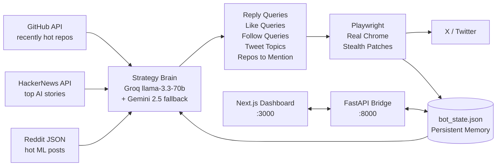

<div align="center">

<br />

# twit-auto

<sub>**[ autonomous · trend-aware · self-pacing ]**</sub>

<br />

#### An X / Twitter growth bot that researches what's actually trending before it speaks.

<sub>Built for builders who'd rather ship code than schedule tweets.</sub>

<br />


<br />


<br />

`╌────────────────────────────────────────────────────────╌`

</div>

<br />

```
   Every cycle, autonomously:

   ▸  researches    →   GitHub trending · HackerNews · Reddit r/LocalLLaMA
   ▸  writes        →   1–3 tweet thread in your voice, on actually-trending topics
   ▸  engages       →   5 thoughtful replies to fresh, rising tweets in your niche
   ▸  likes         →   10 niche tweets to warm the algo signal
   ▸  follows       →   1–2 high-quality accounts (conservatively)
   ▸  remembers     →   never repeats, learns from its own top tweets
```

<br />

> No paid X API. No paid LLM. No proxy required.
> Just a real Chrome browser, a free Groq + Gemini key, and ~110 minutes of
> spread-out activity per cycle.

<br />

---

<br />

## What makes it different

<table>
<tr>
<td width="33%" valign="top">

#### ◆ real trend discovery

Scrapes **GitHub recent-hot repos**, **HackerNews AI stories**, and **Reddit r/LocalLLaMA + r/singularity** every cycle. An LLM strategy brain decides what to search on X based on what's trending *right now* — not a hardcoded list.

</td>
<td width="33%" valign="top">

#### ◆ deterministic + LLM

Regex extracts real repo and product names from the live signal. These get **force-injected** into the bot's search queries — so even if the LLM is lazy, your bot is searching actual trending names.

</td>
<td width="33%" valign="top">

#### ◆ real chrome, not headless

X aggressively blocks Playwright's bundled Chromium. Uses your installed Chrome with a persistent user-data-dir. **Cookie-based login, no password ever stored.**

</td>
</tr>
<tr>
<td valign="top">

#### ◆ live dashboard

A pitch-black, lavender-accented Next.js 14 UI with live SSE logs, analytics charts, full action history, and a **memory page** showing what the bot is thinking right now.

</td>
<td valign="top">

#### ◆ self-improving feedback loop

Each cycle scrapes your own profile, finds top-performing tweets, and feeds them back into the next LLM prompt as style reference. Tweets compound toward what's working.

</td>
<td valign="top">

#### ◆ one-click launcher

Double-click a `.vbs` on your Desktop → 3 hidden background processes start → Chrome auto-opens to the dashboard. Zero terminal flash, zero taskbar clutter.

</td>
</tr>
</table>

<br />

---

<br />

## Architecture



<br />

---

<br />

## Quick start

<sub>Already set up? Double-click **`Start Twit-Auto.vbs`** on your desktop. Done.</sub>

<details>
<summary><b>First-time setup — click to expand</b></summary>

<br />

### Prerequisites

| requirement | why |
|---|---|
| Windows 10/11 | launcher VBS is Windows-specific (the code itself is cross-platform) |
| Python 3.11+ | bot runtime |
| Node.js 18+ | dashboard |
| Google Chrome | real browser channel (bundled Chromium gets blocked by X) |
| an X account | yours to control |
| Groq API key *(free)* | primary LLM — [console.groq.com](https://console.groq.com) |
| Gemini API key *(free)* | rate-limit fallback — [aistudio.google.com](https://aistudio.google.com) |

### 1. Clone

```bash
git clone https://github.com/yuno7777/twitter-automation.git twit-auto
cd twit-auto
```

### 2. Bot deps

```powershell
cd bot
pip install -r requirements.txt
python -m playwright install chromium
```

### 3. Configure `.env` *(project root)*

```env
GROQ_API_KEY=your_groq_key
GEMINI_API_KEY=your_gemini_key
LLM_PROVIDER=groq
HEADLESS=true

# Be specific — this drives every tweet
NICHE=AI agents, LLM workflows, and the gap between AI demos and what actually ships to production.

X_HANDLE=your_handle_no_at
PEAK_HOURS=9,10,13,14,19,20,21
DRY_RUN=false
```

### 4. First login *(saves cookies)*

```powershell
cd bot
$env:HEADLESS="false"
python x_automation_bot.py login
```

A real Chrome window opens. Log in manually. The bot auto-saves cookies once you reach the home feed.

### 5. Customize your voice

Open `bot/prompts/style_notes.txt` and **rewrite it in your own voice**. Single biggest lever for tweet quality.

### 6. Dashboard deps

```powershell
cd ../dashboard
npm install
copy .env.local.example .env.local
```

### 7. Desktop launchers

Place these two files on your Desktop:

**`Start Twit-Auto.vbs`**
```vbs
Set sh = CreateObject("WScript.Shell")
sh.Run "powershell.exe -NoProfile -ExecutionPolicy Bypass -WindowStyle Hidden -File ""C:\path\to\twit-auto\launcher.ps1""", 0, False
```

**`Stop Twit-Auto.vbs`**
```vbs
Set sh = CreateObject("WScript.Shell")
sh.Run "powershell.exe -NoProfile -ExecutionPolicy Bypass -WindowStyle Hidden -File ""C:\path\to\twit-auto\stopper.ps1""", 0, False
```

Update the paths. Also update `$root` at the top of `launcher.ps1` and `stopper.ps1`.

### 8. Launch

Double-click **`Start Twit-Auto.vbs`**. In 5–30 seconds, Chrome opens to `http://localhost:3000`.

</details>

<br />

---

<br />

## The dashboard

<div align="center">

<sub>Five pages. Dark theme. Lavender accents. Glassmorphism.</sub>

</div>

<br />

| page  | what it shows |
|:------|:---|
| `/`              | status, control buttons, countdown to next cycle, stat row, recent activity feed |
| `/memory`        | what the bot is thinking — live trending terms, current strategy, queued tweet angles, GitHub repos on radar |
| `/analytics`     | daily activity stacked bars, hourly activity heatmap, your top-performing tweets |
| `/logs`          | Server-Sent Events stream of `x_bot.log` with colored levels |
| `/history`       | tweets · replies · follows tabs with full history |
| `/settings`      | editable cycle limits, LLM provider, full prompt templates |

<br />

---

<br />

## One cycle, end to end

```
   T+0     initial wake-up delay (1 min)
   T+1     self-engagement scrape  (read own top tweets for style reference)
   T+1     strategy synthesis      (fetch signals → LLM → fresh queries)
   T+2     like 10 niche tweets    (trend-driven queries)
   T+14    generate + post thread  (if in peak hour; pulled from GitHub/HN signal)
   T+16    reply  1                (fresh tweet, 5–500 likes, under 90 min old)
   T+27    reply  2
   T+39    reply  3
   T+51    reply  4
   T+63    reply  5
   T+75    follow 1                (high-quality account)
   T+86    follow 2
   T+97    cycle complete          (sleep ~3–4h before next cycle)
```

<sub>All cooldowns are `random.uniform(10, 12)` minutes — no fixed pattern X can fingerprint.</sub>

<br />

---

<br />

## The intelligence layer

```
   ┌── GitHub ──────────────────────────────────────────────┐
   │   search recently-created repos across 13 AI topics    │
   │   (ai-agents · agentic · llm · rag · mcp · autonomous) │
   │   sort by stars · return top 20                        │
   └────────────────────────────────────────────────────────┘
   ┌── HackerNews ──────────────────────────────────────────┐
   │   top 60 stories → filter for AI keyword regex →       │
   │   return matches with score + comment count            │
   └────────────────────────────────────────────────────────┘
   ┌── Reddit ──────────────────────────────────────────────┐
   │   r/LocalLLaMA hot + r/singularity hot                 │
   │   public JSON · no auth                                │
   └────────────────────────────────────────────────────────┘
                              │
                              ▼
   ┌── trending-term extraction ────────────────────────────┐
   │   regex pulls repo names + capitalised phrases from    │
   │   titles → ['Hermes 3', 'claude-code', 'MCP', 'GPT-OSS']│
   └────────────────────────────────────────────────────────┘
                              │
                              ▼
   ┌── LLM strategy brain ──────────────────────────────────┐
   │   sees:  all signals + memory + trending terms +       │
   │          recent queries the bot ran +                  │
   │          topics already covered + repos already used   │
   │                                                        │
   │   returns: { reply_queries, like_queries,              │
   │              follow_queries, tweet_topics[],           │
   │              github_repos_to_mention[] }               │
   └────────────────────────────────────────────────────────┘
                              │
                              ▼
   ┌── force-inject trending terms ─────────────────────────┐
   │   top 4 extracted terms PREPENDED to reply_queries     │
   │   top 3 PREPENDED to like_queries (deduped)            │
   │   belt-and-suspenders: even if LLM picks generics,     │
   │   the bot still searches actual trending names         │
   └────────────────────────────────────────────────────────┘
```

<br />

---

<br />

## Stealth & safety

| layer | what it does |
|:------|:---|
| real Chrome | `channel="chrome"` with persistent user-data-dir — X trusts it |
| stealth patches | manual `add_init_script` for `navigator.webdriver`, plugins, WebGL, permissions |
| no `playwright-stealth` | that PyPI package is unmaintained and detected |
| cookie-based login | password never touches disk |
| big random cooldowns | 10–12 min between every major action |
| selector resilience | every action wrapped in try/except + auto-screenshots on failure |
| state persistence | never reposts, never re-replies, never re-follows the same target |
| peak-hour gating | posts only during configurable peak hours; engagement continues off-peak |
| `DRY_RUN` mode | test the full cycle without actually posting |

<br />

---

<br />

## File structure

```
twit-auto/
├── bot/
│   ├── x_automation_bot.py     ◀ main bot
│   ├── intelligence.py         ◀ trend discovery + LLM strategy brain
│   ├── api_server.py           ◀ FastAPI bridge
│   ├── prompts/
│   │   ├── tweet_prompt.txt
│   │   ├── trend_tweet_prompt.txt
│   │   ├── reply_prompt.txt
│   │   └── style_notes.txt     ◀ YOUR voice — customize this
│   └── requirements.txt
├── dashboard/
│   ├── app/
│   │   ├── page.tsx            ◀ /  overview
│   │   ├── memory/page.tsx     ◀ /memory     bot brain
│   │   ├── analytics/page.tsx  ◀ /analytics  charts
│   │   ├── logs/page.tsx       ◀ /logs       live SSE
│   │   ├── history/page.tsx    ◀ /history    tweet · reply · follow log
│   │   └── settings/page.tsx   ◀ /settings   editable config
│   ├── components/sidebar.tsx
│   ├── lib/api.ts
│   └── package.json
├── launcher.ps1                ◀ silent multi-process launcher
├── stopper.ps1                 ◀ kill-all script
├── .env                        ◀ secrets (gitignored)
└── .env.example
```

<br />

---

<br />

## Configuration

<sub>All in `.env`</sub>

| variable | default | purpose |
|---|---|---|
| `MAX_POSTS_PER_CYCLE`   | `1` | tweets / threads per cycle |
| `MAX_REPLIES_PER_CYCLE` | `5` | replies — highest growth lever |
| `MAX_LIKES_PER_CYCLE`   | `10` | likes — lowest-risk action |
| `MAX_FOLLOWS_PER_CYCLE` | `2` | follows — keep low to avoid flag |
| `PEAK_HOURS`            | `9,10,13,14,19,20,21` | when posting is allowed |
| `NICHE`                 | *required* | drives every LLM prompt |
| `X_HANDLE`              | *required* | for self-engagement feedback |
| `DRY_RUN`               | `false` | log actions without performing them |
| `PROXY_URL`             | *empty* | residential proxy for 24/7 use |

<br />

---

<br />

## Tech stack

<div align="center">

| layer | tools |
|:------|:---|
| browser automation | Playwright + real Chrome with persistent profile |
| LLM (primary) | Groq `llama-3.3-70b-versatile` |
| LLM (fallback) | Google `gemini-2.5-flash` |
| trend sources | GitHub API · HackerNews · Reddit JSON |
| backend | FastAPI · Uvicorn |
| frontend | Next.js 14 · Tailwind · Recharts · SWR · Lucide |
| state | single `bot_state.json` with atomic writes |

</div>

<br />

---

<br />

## Troubleshooting

<details>
<summary><b>Dashboard says "offline" after launch</b></summary>
<br />

- Check `logs/launcher.err.log`
- Check `logs/bot.log` and `logs/api.log` for Python tracebacks
- Make sure `python --version` is 3.11+
- Try `Stop Twit-Auto.vbs` → wait 5s → `Start Twit-Auto.vbs`
</details>

<details>
<summary><b>Bot logs say "selector failed"</b></summary>
<br />

X changes its UI periodically. Check `bot/debug_screenshots/` to see what the bot saw at failure time. Update the `SELECTORS` dict at the top of `bot/x_automation_bot.py`.
</details>

<details>
<summary><b>Login flow loops back to the login page</b></summary>
<br />

X blocks Playwright's bundled Chromium. The code uses `channel="chrome"` which loads your real installed Chrome — make sure Google Chrome is installed and reachable.
</details>

<details>
<summary><b>Account suspended</b></summary>
<br />

- Check `bot/x_bot.log` for the rate at which you were posting / following
- Lower `MAX_REPLIES_PER_CYCLE` and `MAX_FOLLOWS_PER_CYCLE` in `.env`
- For the next account, configure a residential `PROXY_URL`
- Wait, appeal, learn
</details>

<br />

---

<br />

## Roadmap

```
   [ ]   image attachment via OG-image extraction from news / repos
   [ ]   quote-tweet support (high-leverage on viral posts)
   [ ]   followers-of-followers discovery (smarter follow targeting)
   [ ]   real-time engagement tracking per tweet (impressions, likes over time)
   [ ]   multi-account orchestration
   [ ]   macros / templates editor in dashboard
```

<sub>PRs welcome.</sub>

<br />

---

<br />

## Disclaimer

This is for **personal / educational growth use**. Respect X's terms. Use conservatively. The defaults are deliberately low because long-term account safety > short-term volume. Don't run this on someone else's account.

<br />

---

<br />

<div align="center">

`╌────────────────────────────────────────────────────────╌`

<br />

**built by [@yuno7777](https://github.com/yuno7777) · MIT**

<sub>*if you ship something cool with this, tag me on X*</sub>

</div>
